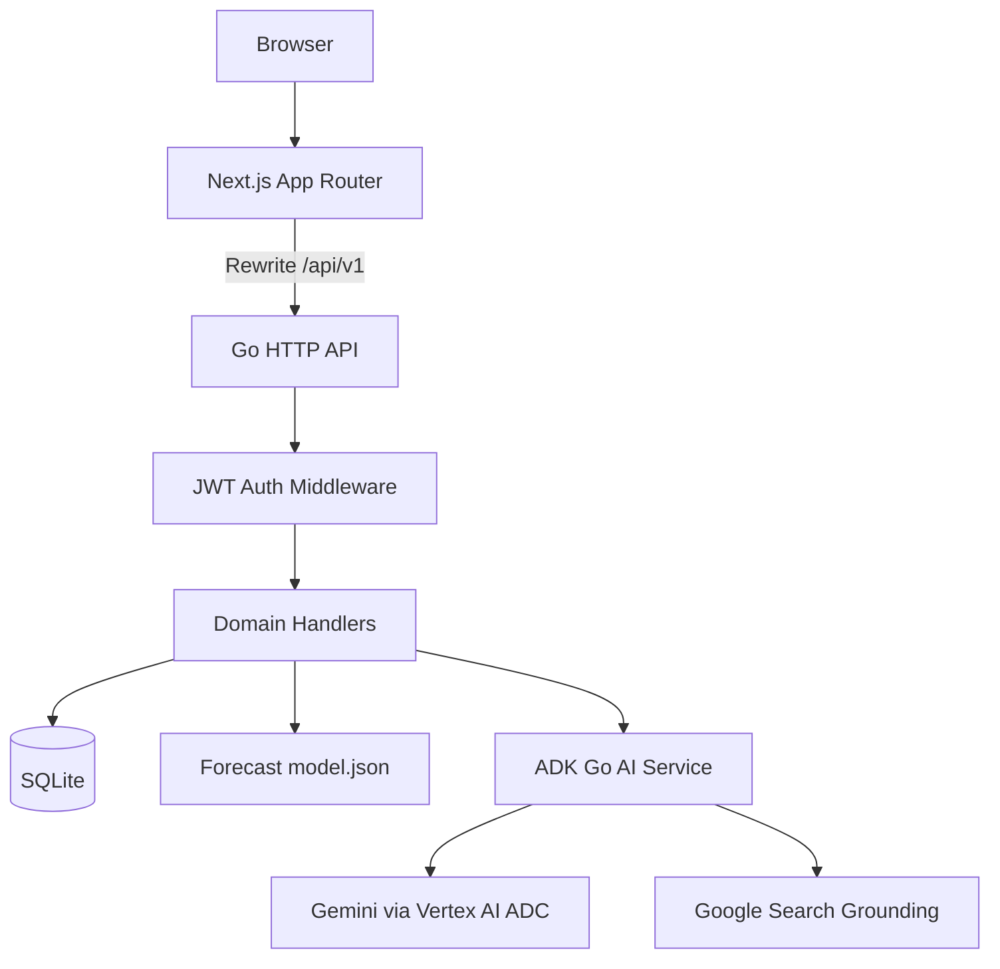
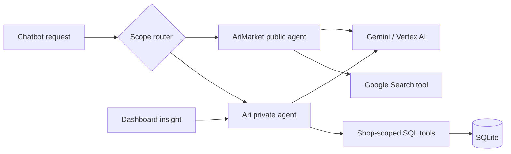
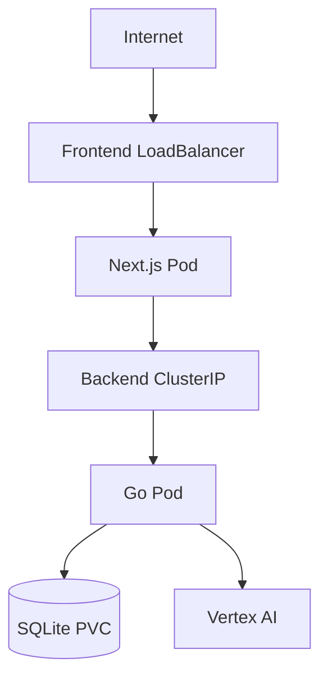

# System Architecture

## Runtime Topology



## Frontend

```text
frontend/src/app
├── Public routes
│   ├── Landing
│   ├── Login
│   └── Signup / OTP / Success
└── (app) protected routes
    ├── Dashboard
    ├── Stock
    ├── Finance
    ├── Forecast
    ├── Chatbot
    └── Settings
```

Authenticated layout:

```text
RequireAuth
└── ChatbotProvider
    └── AppShell
        ├── Sidebar
        ├── Topbar
        ├── Page content
        └── FloatingChatbot
```

The frontend talks to `/api/v1/*`. Next rewrites those requests to the backend.
The browser never calls Gemini directly.

## Backend

```text
cmd/server/main.go
├── CORS middleware
├── SQLite initialization
├── JWT auth middleware
├── FinanceHandler
├── ProductHandler
├── DashboardHandler
├── SalesHandler
├── ForecastHandler
├── NotificationHandler
├── SettingsHandler
├── ChatbotHandler
└── InsightsHandler
```

Every protected request extracts `user_id` and `shop_id` from the JWT context.
Handlers use `shop_id` in SQL predicates to enforce tenant isolation.

## AI Topology



Private agent tools:

- Stock summary.
- Product search.
- Finance summary.
- Restock forecast.
- Notifications.
- Dashboard metrics.

Market agent tools:

- Google Search only.
- No shop database tools.
- No private stock, sales, customer, or finance context.
- Returns source citations and public trend context.

## Request Flow: Sale

```text
Quick Scan or Catat Manual
  -> GET /products/sku/{code} or GET /products
  -> POST /sales
  -> validate unit precision
  -> validate stock availability
  -> insert sales rows
  -> decrement product stock
  -> insert income transaction
  -> commit
  -> refresh dashboard/stock data
```

## Request Flow: Notifications

```text
GET /notifications
  -> generate current product/order/transaction events
  -> load notification_states for user + shop
  -> exclude dismissed events
  -> calculate unread count

PATCH /notifications/{id}
  -> persist read/dismissed state
  -> optimistic Topbar update
```

## Deployment



Current Kubernetes deployment is prototype-grade:

- One backend replica.
- SQLite on one ReadWriteOnce PVC.
- Frontend public LoadBalancer.
- Mutable `latest` image tags.
- No HTTPS Ingress, probes, resource limits, or committed Secret manifest.

Production target:

- HTTPS Ingress.
- Vertex Workload Identity.
- Immutable image digests.
- Readiness/liveness probes.
- Automated SQLite backup/restore or managed relational database.
- Persistent AI sessions before multiple backend replicas.
