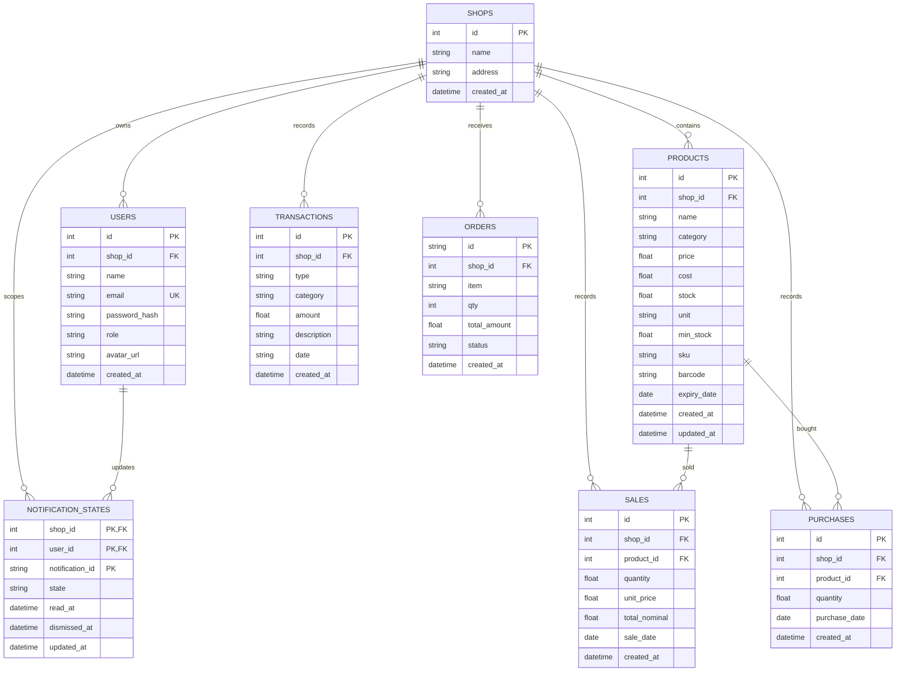

# Entity Relationship Diagram

## Quantity Rules

- Discrete units: `pcs`, `pack`, `box`, `bottle` use whole quantities.
- Continuous units: `kg`, `g`, `liter`, `ml` support two decimals.
- Existing products default to `pcs`.
- `shop_id` is the primary tenant boundary for application queries.

## Persistence Notes

- SQLite is initialized by `backend/internal/database/db.go`.
- Additive migrations run during startup.
- Seed data is intended for prototype/demo use.
- SQLite is currently stored on a Kubernetes PVC.
- Historical sale cost is not yet snapshotted; changing product cost can affect historical HPP.
